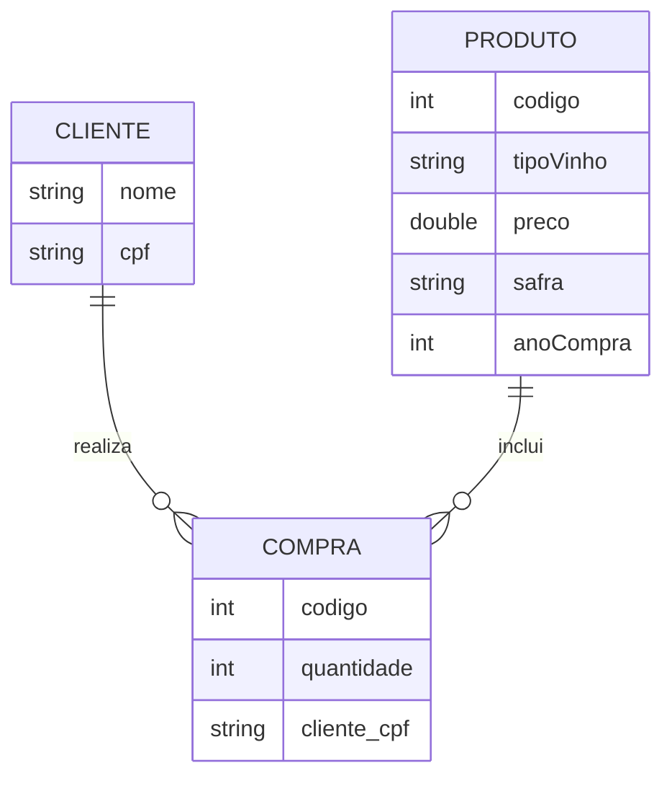

### Documentação do Projeto WinePurchase

#### Visão Geral

Este é um projeto de avaliação Java com Spring Boot, onde o teste possui quatro desafios:
- listar compras; 
- obter a maior compra do ano; 
- identificar clientes fiéis
- recomendar vinhos;
Ele consome dados mockados de clientes e produtos.

#### Estrutura do Projeto

```
src/
├── main/
│   ├── java/
│   │   └── br/com/winepurchase/api/
│   │       ├── WinePurchaseApplication.java
│   │       ├── config/
│   │       │   ├── CorsConfig.java
│   │       │   ├── GlobalExceptionHandler.java
│   │       │   ├── ResourceNotFoundException.java
│   │       │   ├── RestTemplateConfig.java
│   │       │   ├── SwaggerConfig.java
│   │       ├── controller/
│   │       │   └── CompraController.java
│   │       ├── mapper/
│   │       │   └── ProdutoMapper.java
│   │       ├── model/
│   │       │   ├── domain/
│   │       │   │   └── ProdutoDomain.java
│   │       │   ├── dto/
│   │       │   │   ├── ClienteComprasDTO.java
│   │       │   │   ├── ClienteDTO.java
│   │       │   │   ├── CompraDTO.java
│   │       │   │   ├── CompraDetalhadaDTO.java
│   │       │   │   ├── ErrorResponse.java
│   │       │   │   ├── MaiorCompraDTO.java
│   │       │   │   └── ProdutoDTO.java
│   │       └── service/
│   │           └── CompraService.java
│   ├── resources/
│   │   ├── application.yml
├── test/
│   └── java/
│       └── br/com/winepurchase/api/
│           └── WinePurchaseApplicationTests.java
```

#### Dependências

As principais dependências do projeto incluem Spring Boot, Lombok, MapStruct, Jackson, Swagger, e bibliotecas para testes como JUnit e Mockito. Abaixo estão algumas das principais dependências do `pom.xml`:

Por não ter tido muito tempo para implementar os testes eu acabei removendo as bibliotecas.

```xml
<dependencies>
    <dependency>
        <groupId>org.springframework.boot</groupId>
        <artifactId>spring-boot-starter-web</artifactId>
    </dependency>
    <dependency>
        <groupId>org.projectlombok</groupId>
        <artifactId>lombok</artifactId>
        <version>${version.lombok}</version>
        <scope>provided</scope>
    </dependency>
    <dependency>
        <groupId>org.mapstruct</groupId>
        <artifactId>mapstruct</artifactId>
        <version>${org.mapstruct.version}</version>
    </dependency>
    <dependency>
        <groupId>org.mapstruct</groupId>
        <artifactId>mapstruct-processor</artifactId>
        <version>${org.mapstruct.version}</version>
        <scope>provided</scope>
    </dependency>
    <dependency>
        <groupId>io.springfox</groupId>
        <artifactId>springfox-boot-starter</artifactId>
        <version>3.0.0</version>
    </dependency>
    <dependency>
        <groupId>com.fasterxml.jackson.core</groupId>
        <artifactId>jackson-databind</artifactId>
    </dependency>
    <dependency>
        <groupId>com.fasterxml.jackson.core</groupId>
        <artifactId>jackson-core</artifactId>
    </dependency>
    <dependency>
        <groupId>com.fasterxml.jackson.core</groupId>
        <artifactId>jackson-annotations</artifactId>
    </dependency>
    <!-- Dependências para testes -->
    <dependency>
        <groupId>org.springframework.boot</groupId>
        <artifactId>spring-boot-starter-test</artifactId>
        <scope>test</scope>
    </dependency>
    <dependency>
        <groupId>org.mockito</groupId>
        <artifactId>mockito-core</artifactId>
        <scope>test</scope>
    </dependency>
    <dependency>
        <groupId>com.github.tomakehurst</groupId>
        <artifactId>wiremock-jre8</artifactId>
        <version>2.27.2</version>
        <scope>test</scope>
    </dependency>
</dependencies>
```

#### Configuração do Aplicativo

**`application.yml`**

```yaml
server:
  port: 8080

spring:
  application:
    name: ms-winepurchase
  jackson:
    serialization:
      indent_output: true
    default-property-inclusion: non_null

cors:
  allowed-origins: "*"
  allowed-methods: "*"

springfox:
  documentation:
    swagger:
      v2:
        path: /api-docs

app:
  urls:
    clientes: https://rgr3viiqdl8sikgv.public.blob.vercel-storage.com/clientes-Vz1U6aR3GTsjb3W8BRJhcNKmA81pVh.json
    produtos: https://rgr3viiqdl8sikgv.public.blob.vercel-storage.com/produtos-mnboX5IPl6VgG390FECTKqHsD9SkLS.json
```

#### Endpoints

1. **GET /compras**
   - Retorna uma lista das compras ordenadas de forma crescente por valor, contendo o nome dos clientes, CPF dos clientes, dados dos produtos, quantidade das compras e valores totais de cada compra.

2. **GET /maior-compra/{ano}**
   - Retorna a maior compra do ano informado, contendo o nome do cliente, CPF do cliente, dados do produto, quantidade da compra e seu valor total.

3. **GET /clientes-fieis**
   - Retorna o Top 3 clientes mais fiéis, clientes que possuem mais compras recorrentes com maiores valores.

4. **GET /recomendacao/cliente/tipo**
   - Retorna uma recomendação de vinho baseado nos tipos de vinho que o cliente mais compra.

#### Exceções

**GlobalExceptionHandler.java**

```java
@RestControllerAdvice
public class GlobalExceptionHandler {

    @ExceptionHandler(ResourceNotFoundException.class)
    public ResponseEntity<ErrorResponse> handleResourceNotFoundException(ResourceNotFoundException ex) {
        ErrorResponse errorResponse = new ErrorResponse(ex.getMessage());
        return new ResponseEntity<>(errorResponse, HttpStatus.NOT_FOUND);
    }

    @ExceptionHandler(Exception.class)
    public ResponseEntity<ErrorResponse> handleGeneralException(Exception ex) {
        ErrorResponse errorResponse = new ErrorResponse("Um erro inesperado ocorreu");
        return new ResponseEntity<>(errorResponse, HttpStatus.INTERNAL_SERVER_ERROR);
    }
}
```

### Dockerização

#### Dockerfile

Crie um arquivo chamado `Dockerfile` na raiz do projeto com o seguinte conteúdo:

```Dockerfile
FROM openjdk:11-jre-slim

WORKDIR /app

COPY target/vinho-microservice-1.0.0.jar app.jar

EXPOSE 8080

ENTRYPOINT ["java", "-jar", "app.jar"]
```

#### Docker Compose

**`docker-compose.yml`**

```yaml
version: '3.8'
services:
  vinho-microservice:
    image: vinho-microservice:latest
    build:
      context: .
      dockerfile: Dockerfile
    ports:
      - "8080:8080"
```

#### Construção e Execução da Imagem Docker

1. **Construir o projeto com Maven**
   ```bash
   mvn clean package
   ```

2. **Construir a imagem Docker**
   ```bash
   docker build -t vinho-microservice:latest .
   ```

3. **Executar o contêiner Docker**
   ```bash
   docker run -p 8080:8080 vinho-microservice:latest
   ```

#### Usando Docker Compose

Para iniciar a aplicação com Docker Compose, execute:

```bash
docker-compose up --build
```

Para parar e remover os contêineres e a rede definida pelo Compose:

```bash
docker-compose down
```

### Diagrama de Entidade-Relacionamento (DER)

Aqui está o Diagrama de Entidade-Relacionamento para o projeto:



### Executando o Projeto

1. **Clonar

o repositório**
   ```bash
   git clone https://github.com/guimaraes/WinePurchase.git
   cd vinho-microservice
   ```

2. **Compilar o projeto**
   ```bash
   mvn clean package
   ```

3. **Executar o projeto**
   ```bash
   mvn spring-boot:run
   ```

### Documentação Swagger

Depois de iniciar o aplicativo, você pode acessar a documentação Swagger em `http://localhost:8080/swagger-ui.html` para explorar e testar os endpoints.
